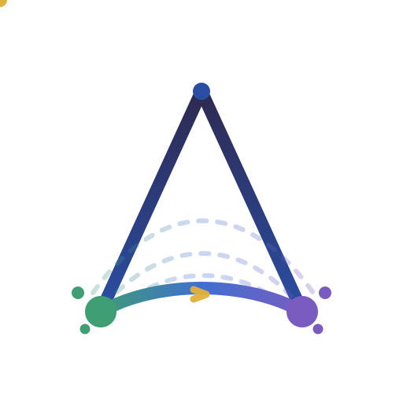

<p align="center">
  
</p>

<p align="center">
    <a href="https://pypi.org/project/torchdeltaflow/" target="_blank" title="PyPI version">
        
    </a>
    <a href="https://github.com/phrugsa-limbunlom/deltaflow/blob/main/LICENSE" target="_blank" title="License">
        
    </a>
    <a href="https://github.com/phrugsa-limbunlom/deltaflow" target="_blank" title="GitHub Repo Stars">
        
    </a>
    <a href="https://pypi.org/project/torchdeltaflow/" target="_blank" title="Python Versions">
        
    </a>
</p>

<h1 align="center">DeltaFlow: optimal-transport flow matching for data-scarce domains</h1>
<h3 align="center">Composable PyTorch primitives for representation learning and posterior sampling, built around the displacement between two distributions.</h3>

<p align="center">
  
  <br>
  <em>A learned field integrated from noise onto data with <code>FlowSampler</code>.</em>
</p>

## What is DeltaFlow?

DeltaFlow is a PyTorch library for generative modelling in data-scarce domains such as medical imaging, with a focus on representation learning and studying the underlying data distribution rather than sample synthesis alone. It targets 2D radiography (chest X-ray, cephalometric, and hand radiographs), yet the core primitives stay domain-agnostic.

The whole library follows from one idea, a **delta** (the change carried from a source distribution to a target one) and the **flow** that realises it.

- **Δ, the change between two distributions.** The learning signal is a displacement, $\Delta = x_1 - x_0$, the straight-line velocity that carries a source sample $x_0$ (noise) onto a data sample $x_1$. Regressing a field onto this displacement is exactly the flow-matching objective.
- **Flow, integrating the change.** A learned field $v_\theta(x, t)$ is integrated as an ODE, $dx/dt = v_\theta(x, t)$, transporting the whole source density onto the data density with a simple Euler or Heun solver.
- **Straighter Δ via optimal transport.** Which target each source pairs with is a choice. Mini-batch optimal-transport coupling solves the discrete Kantorovich assignment on each batch, so the displacements stay short and the flow stays straight, which is what lets the model sample in fewer steps.

So DeltaFlow implements each component once and lets the method be a configuration.

| Component | The question it answers | Package |
|---|---|---|
| **Velocity field** | what carries noise onto data? | `deltaflow.core`, `deltaflow.models` |
| **Interpolant** | along which path do noise and data connect? | `deltaflow.interpolants` |
| **Coupling** | which noise sample is paired with which datum? | `deltaflow.trainer` |
| **Objective** | how is the field fit to data? | `deltaflow.losses` |
| **Solver** | which dynamics turn the field into samples? | `deltaflow.solvers` |
| **Inverse** | how does one measurement steer sampling? | `deltaflow.inverse` |

Compose them one way and you have flow matching with an independent coupling. Another way and you have OT-coupled rectified flow. Another and you have posterior sampling for an inverse problem, reusing the very same pretrained field.

Full documentation lives on the [**DeltaFlow website**](https://phrugsa-limbunlom.github.io/deltaflow/latest/).

## What's inside

### Probability paths (`deltaflow.interpolants`)

The path decides how noise becomes data. Every path returns the interpolated state $x_t$ and its conditional target velocity $u_t$.

| Interpolant | Path |
|---|---|
| `LinearInterpolant` | straight-line rectified-flow path, $x_t = (1-t)x_0 + t x_1$, $u_t = x_1 - x_0$ |
| `VariancePreservingInterpolant` | trigonometric diffusion path, $\alpha_t = \sin(\tfrac{\pi}{2}t)$, $\sigma_t = \cos(\tfrac{\pi}{2}t)$ |
| `OTInterpolant` | the linear path applied after a mini-batch OT re-ordering of $x_0$ |

### Couplings (`deltaflow.trainer`)

The coupling decides which noise becomes which datum. Straighter pairings mean straighter paths and fewer sampling steps.

| Coupling | Pairing |
|---|---|
| `IndependentCoupling` | draw $x_0 \sim \mathcal{N}(0, I)$ independently of $x_1$, the classical setup |
| `OTCoupling` | permute $x_0$ within the batch to minimise squared transport cost (Hungarian, greedy fallback) |

### Objectives (`deltaflow.losses`)

| Objective | Idea |
|---|---|
| `FlowMatchingLoss` / `ConditionalFlowMatchingLoss` | regress $v_\theta(x_t, t)$ onto the path's conditional velocity $u_t$ |
| `DeltaAlignmentLoss` | align the guidance-difference feature $\Delta h = h_\text{cond} - h_\text{uncond}$ across two views, an anatomy-cancelling representation loss |

### Solvers (`deltaflow.solvers`)

| Solver | Dynamics |
|---|---|
| `EulerSolver` (`FlowSampler`) | first-order explicit Euler integration of the flow ODE |
| `HeunSolver` | second-order Heun integration, more accurate at low step counts |
| `PosteriorSolver` | wraps any base solver and injects a measurement-likelihood gradient per step |

### Inverse problems (`deltaflow.inverse`)

Measurement operators (`MaskOperator`, `BlurOperator`, `DownsampleOperator`, `IdentityOperator`), a flow-matching Tweedie decomposition (`LinearTweedie`, `VPTweedie`) that recovers a clean-signal estimate from $(x_t, v_t, t)$, and Gaussian likelihoods (`GaussianLikelihood`) with an optional decoder pullback for the latent-space case.

## Install

```bash
pip install torchdeltaflow
# or, from source with docs and dev tooling:
pip install -e ".[dev]"
```

The import name is `deltaflow`.

## Usage

Each block below is one method, in as few lines as it takes. Annotated, full-scale versions live in the [examples gallery](https://github.com/phrugsa-limbunlom/deltaflow/tree/main/examples).

### Flow matching

[Flow Matching for Generative Modeling](https://arxiv.org/abs/2210.02747), Lipman et al. 2023. Regress a velocity field onto the conditional velocity of a probability path. With DeltaFlow's primitives, that is the loop itself.

<p align="center">
  
  <br>
  <em>Noise at <code>t=0</code> reshaped into the two-moons data manifold at <code>t=1</code>. The faint cloud is the target reference.</em>
</p>

```python
import torch
from deltaflow.interpolants import LinearInterpolant
from deltaflow.losses import FlowMatchingLoss
from deltaflow.samplers import FlowSampler

loss_fn = FlowMatchingLoss(interpolant=LinearInterpolant())
loss = loss_fn(model, x1)                        # model(x_t, t) -> predicted velocity
loss.backward()

samples = FlowSampler(model).sample(torch.randn(1000, 2), n_steps=50)
```

### Optimal-transport couplings

[Improving and generalizing flow-based generative models with minibatch optimal transport](https://arxiv.org/abs/2302.00482), Tong et al. 2024. Pair each noise sample with the right datum and the paths straighten, so generation needs fewer steps. This hard assignment is the zero-entropy limit of the static Schrödinger bridge.

<p align="center">
  
  <br>
  <em>The same source and target clouds under two couplings. The independent pairing sweeps long crossing paths, the OT pairing stays an orderly bundle at lower transport cost.</em>
</p>

```python
from deltaflow.losses import ConditionalFlowMatchingLoss
from deltaflow.trainer import OTCoupling

loss_fn = ConditionalFlowMatchingLoss(coupling=OTCoupling())   # same objective, OT pairs
loss = loss_fn(model, x1)
```

### Variance-preserving path

[SiT: Exploring Flow and Diffusion-based Generative Models with Scalable Interpolant Transformers](https://arxiv.org/abs/2401.08740), Ma et al. 2024, building on [Stochastic Interpolants](https://arxiv.org/abs/2303.08797), Albergo et al. 2023. Swap the interpolant and the same loss and solver run a variance-preserving diffusion path instead of the straight one.

```python
from deltaflow.interpolants import VariancePreservingInterpolant
from deltaflow.losses import FlowMatchingLoss

loss_fn = FlowMatchingLoss(interpolant=VariancePreservingInterpolant())
loss = loss_fn(model, x1)
```

### Delta alignment

The same difference principle powers an optional representation-learning loss. For a conditionally-generated backbone, the guidance-difference feature $\Delta h = h_\text{cond} - h_\text{uncond}$ isolates what the conditioning changed at each hierarchy level, largely cancelling the anatomy both passes share. Aligning $\Delta h$ across two augmented views encourages a guidance representation that is consistent regardless of anatomy. The guidance difference itself follows [Classifier-Free Diffusion Guidance](https://arxiv.org/abs/2207.12598), Ho & Salimans 2022.

```python
from deltaflow.losses import DeltaAlignmentLoss
from deltaflow.models import MultiScaleProjector

projector = MultiScaleProjector(feature_dims={"enc_1_4": 256, "bottleneck": 1024})
loss_fn = DeltaAlignmentLoss(projector, lambda_flow=1.0, lambda_align=5.0)

total, loss_dict = loss_fn(
    v_c1, v_u1, target_v1,
    v_c2, v_u2, target_v2,
    feats_u1, feats_c1, feats_u2, feats_c2,
)
```

### Posterior sampling for inverse problems

[FlowDPS: Flow-Driven Posterior Sampling for Inverse Problems](https://arxiv.org/abs/2503.08136), Kim et al. 2025, and [Flower: A Flow-Matching Solver for Inverse Problems](https://arxiv.org/abs/2509.26287), Pourya et al. 2025. Reconstruct a masked or degraded measurement with a field trained once, no retraining. `PosteriorSolver` wraps the same Euler solver and injects a measurement-likelihood gradient at every step, so the base integrator is reused rather than re-implemented.

<p align="center">
  
  <br>
  <em>The posterior mean fills a masked centre step by step. The known pixels stay anchored by the likelihood while the flow supplies the rest.</em>
</p>

```python
import torch
from deltaflow.inverse import GaussianLikelihood, LinearTweedie, MaskOperator
from deltaflow.solvers import EulerSolver, PosteriorSolver

likelihood = GaussianLikelihood(y=y, operator=MaskOperator(mask), sigma=1.0)
solver = PosteriorSolver(
    base_solver=EulerSolver(model),
    likelihood=likelihood,
    tweedie=LinearTweedie(),
    guidance_scale=0.5,
    grad_normalize=True,
)
x = solver.sample(torch.randn(16, 1, 16, 16), n_steps=60)     # posterior samples
```

## Visualizing the algorithm

Beyond the animations above, [`examples/90-showcase/02-sampling-flow-viz/`](https://github.com/phrugsa-limbunlom/deltaflow/tree/main/examples/90-showcase/02-sampling-flow-viz) records every intermediate state of a small MLP field trained on a 2D two-moons target.

<p align="center">
  
  <br>
  <em>Individual sample paths from noise to data, traced as streamlines.</em>
</p>

<p align="center">
  
  <br>
  <em>Quiver plots of <code>v(x, t)</code> at three times, pointing broadly inward early on and resolving the two-moons structure by <code>t ≈ 0.9</code>.</em>
</p>

Reproduce every figure with:

```bash
pip install -e ".[dev]" matplotlib
python examples/90-showcase/02-sampling-flow-viz/main.py     # sampling flow figures and gif
python examples/90-showcase/03-minibatch-ot-viz/main.py      # OT vs independent coupling
python examples/90-showcase/04-inverse-posterior-viz/main.py # posterior reconstruction
```

## Examples

The [`examples/`](https://github.com/phrugsa-limbunlom/deltaflow/tree/main/examples) tree is a tiered, runnable curriculum.

| Tier | You learn to |
|---|---|
| [`00-foundations/`](https://github.com/phrugsa-limbunlom/deltaflow/tree/main/examples/00-foundations) | work with interpolants and the linear probability path |
| [`10-sampling/`](https://github.com/phrugsa-limbunlom/deltaflow/tree/main/examples/10-sampling) | integrate a learned field with the Euler and Heun solvers |
| [`20-training/`](https://github.com/phrugsa-limbunlom/deltaflow/tree/main/examples/20-training) | fit a field with flow matching, OT coupling, and delta alignment |
| [`90-showcase/`](https://github.com/phrugsa-limbunlom/deltaflow/tree/main/examples/90-showcase) | study end-to-end demos and the visualizations above |

## Development

```bash
pip install -e ".[dev]"
pytest
```

## Contributing

Contributions are welcome. Please read [CONTRIBUTING.md](CONTRIBUTING.md) before getting started.

## Citation

If DeltaFlow is useful in your research, please cite it (see [CITATION.cff](CITATION.cff)):

```bibtex
@misc{deltaflow_library_2025,
  author = {Limbunlom, Phrugsa},
  title  = {{DeltaFlow}: Optimal-Transport Flow Matching for Data-Scarce Domains in {PyTorch}},
  year   = {2025},
  url    = {https://github.com/phrugsa-limbunlom/deltaflow},
}
```

## Citations

DeltaFlow builds on the following work.

```bibtex
@inproceedings{lipman2023flow,
  title  = {Flow Matching for Generative Modeling},
  author = {Lipman, Yaron and Chen, Ricky T. Q. and Ben-Hamu, Heli and Nickel, Maximilian and Le, Matt},
  year   = {2023},
  eprint = {2210.02747},
  url    = {https://arxiv.org/abs/2210.02747},
}
```

```bibtex
@inproceedings{liu2023flow,
  title  = {Flow Straight and Fast: Learning to Generate and Transfer Data with Rectified Flow},
  author = {Liu, Xingchao and Gong, Chengyue and Liu, Qiang},
  year   = {2023},
  eprint = {2209.03003},
  url    = {https://arxiv.org/abs/2209.03003},
}
```

```bibtex
@article{albergo2023stochastic,
  title  = {Stochastic Interpolants: A Unifying Framework for Flows and Diffusions},
  author = {Albergo, Michael S. and Boffi, Nicholas M. and Vanden-Eijnden, Eric},
  year   = {2023},
  eprint = {2303.08797},
  url    = {https://arxiv.org/abs/2303.08797},
}
```

```bibtex
@article{ma2024sit,
  title  = {SiT: Exploring Flow and Diffusion-based Generative Models with Scalable Interpolant Transformers},
  author = {Ma, Nanye and Goldstein, Mark and Albergo, Michael S. and Boffi, Nicholas M. and Vanden-Eijnden, Eric and Xie, Saining},
  year   = {2024},
  eprint = {2401.08740},
  url    = {https://arxiv.org/abs/2401.08740},
}
```

```bibtex
@article{tong2024improving,
  title   = {Improving and generalizing flow-based generative models with minibatch optimal transport},
  author  = {Tong, Alexander and Fatras, Kilian and Malkin, Nikolay and Huguet, Guillaume and Zhang, Yanlei and Rector-Brooks, Jarrid and Wolf, Guy and Bengio, Yoshua},
  journal = {Transactions on Machine Learning Research},
  year    = {2024},
  eprint  = {2302.00482},
  url     = {https://arxiv.org/abs/2302.00482},
}
```

```bibtex
@inproceedings{ho2022classifier,
  title  = {Classifier-Free Diffusion Guidance},
  author = {Ho, Jonathan and Salimans, Tim},
  year   = {2022},
  eprint = {2207.12598},
  url    = {https://arxiv.org/abs/2207.12598},
}
```

```bibtex
@inproceedings{kim2025flowdps,
  title  = {FlowDPS: Flow-Driven Posterior Sampling for Inverse Problems},
  author = {Kim, Jeongsol and Kim, Bryan Sangwoo and Ye, Jong Chul},
  year   = {2025},
  eprint = {2503.08136},
  url    = {https://arxiv.org/abs/2503.08136},
}
```

```bibtex
@article{pourya2025flower,
  title  = {Flower: A Flow-Matching Solver for Inverse Problems},
  author = {Pourya, Mehrsa and El Rawas, Bassam and Unser, Michael},
  year   = {2025},
  eprint = {2509.26287},
  url    = {https://arxiv.org/abs/2509.26287},
}
```

```bibtex
@article{debortoli2021diffusion,
  title  = {Diffusion Schr{\"o}dinger Bridge with Applications to Score-Based Generative Modeling},
  author = {De Bortoli, Valentin and Thornton, James and Heng, Jeremy and Doucet, Arnaud},
  year   = {2021},
  eprint = {2106.01357},
  url    = {https://arxiv.org/abs/2106.01357},
}
```

## License

MIT. See [LICENSE](LICENSE).
