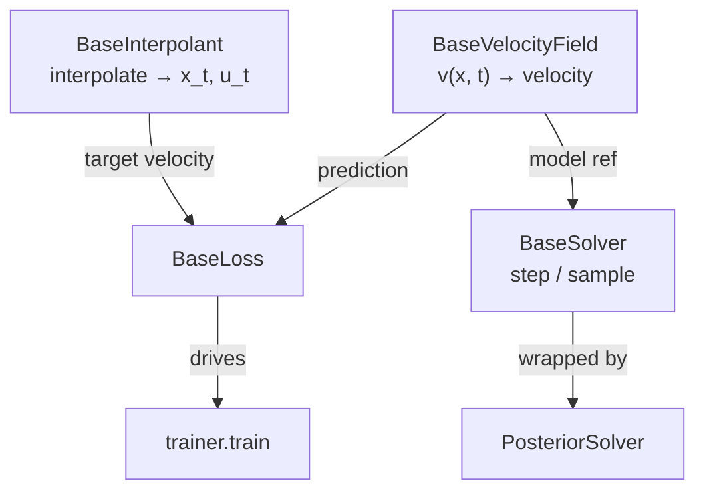

# Architecture

DeltaFlow is built around **four abstract base classes** in `deltaflow.core`.
Every user-facing component subclasses one of them, so new variants are drop-in
rather than rewrites of the surrounding machinery.



## The four bases

### `BaseVelocityField(nn.Module)`

```python
def forward(self, x, t, **cond) -> torch.Tensor: ...
```

Returns a tensor the same shape as `x`. Any extra conditioning (a guidance
flag, class label, cross-attention context) is passed as `**cond` and
forwarded **unchanged** by every loss and solver (generic code never assumes
specific keys).

### `BaseInterpolant`

```python
def interpolate(self, x1, t, x0=None) -> (x_t, target_velocity): ...
```

Defines the probability path. **Time convention: `t=0` is noise, `t=1` is
data.**

### `BaseSolver`

Holds a `model` reference and a `time_scale`. `step()` is the per-step rule,
while `sample()` loops it from `t_start` to `t_end`. `_eval_velocity` multiplies `t`
by `time_scale` before calling the model, so a backbone trained with a
different numeric time convention still integrates correctly.

### `BaseLoss`

The common interface for training objectives (flow matching, delta alignment).

## Key composition patterns

Three patterns are best understood by reading across modules:

- **`PosteriorSolver` wraps a base solver.** Instead of re-implementing
  integration, it hooks a likelihood gradient into each `step()` call. See
  [Inverse Problems](../guides/inverse-problems.md).
- **`DeltaAlignmentLoss` consumes per-level feature dicts** and a
  `MultiScaleProjector`, operating on \(\Delta h = h_\text{cond} -
  h_\text{uncond}\). See [Delta Alignment](../guides/delta-alignment.md).
- **`trainer.train` is framework-light.** Mixed precision, grad accumulation,
  checkpoint/resume, EMA, and pluggable coupling in a plain loop. See
  [Training](../guides/training.md).

## Conventions

- Import bases from `deltaflow.core` (e.g.
  `from deltaflow.core import BaseVelocityField`). The modules
  `core/base.py` and `interpolants/base.py` are backward-compat shims.
- Use the numerical helpers in [`deltaflow.utils`](../api/utils.md)
  (`safe_normalize`, `safe_sqrt`, `clamp_*`) in loss/feature math. They keep
  FP16/BF16 autocast from producing NaN/Inf.
