# Examples

The repository ships a runnable, tiered curriculum under
[`examples/`](https://github.com/phrugsa-limbunlom/deltaflow/tree/main/examples).
Each example runs standalone in well under a minute on CPU, so you can read the
source, run it, and tinker in one sitting.

| Tier | Focus |
|---|---|
| `00-foundations/` | Core primitives in isolation (the linear interpolant) |
| `10-sampling/` | ODE sampling from a learned field (Euler flow) |
| `20-training/` | Flow-matching and delta-alignment training runs |
| `30-inverse/` | Posterior sampling for inverse problems |
| `90-showcase/` | End-to-end demos and visualizations |

Run any of them the same way (from the repository root).

```bash
pip install -e ".[dev]"
python examples/00-foundations/01-linear-interpolant/main.py
```

---

## 00 foundations, the linear interpolant

[`examples/00-foundations/01-linear-interpolant/main.py`](https://github.com/phrugsa-limbunlom/deltaflow/blob/main/examples/00-foundations/01-linear-interpolant/main.py)

The interpolant is the smallest primitive in the whole library. It defines the
probability path (how a noise sample and a data sample are blended at each time
`t`) and, crucially, the target velocity the model is trained to predict. This
example builds a `LinearInterpolant`, walks `t` from 0 to 1, and prints the
intermediate point and its target velocity.

```python
from deltaflow.interpolants import LinearInterpolant

interpolant = LinearInterpolant()
x1 = torch.randn(4, 2)   # data  (t=1)
x0 = torch.randn(4, 2)   # noise (t=0)

x_t, u_t = interpolant.interpolate(x1, t=torch.full((4,), 0.5), x0=x0)
```

What to notice.

- The path is the straight line \(x_t = (1-t)\,x_0 + t\,x_1\), so the target
  velocity is the constant displacement \(u_t = x_1 - x_0\). This is the
  **delta** the whole library is named after, the change that carries one
  distribution onto the other.
- The boundary conditions are exact. At `t=0` the point equals `x0`, at `t=1` it
  equals `x1`. The example asserts both, which is the sanity check every new
  interpolant must pass.

Run it first. Every later tier assumes you have this picture in your head.

---

## 10 sampling, Euler flow

[`examples/10-sampling/01-euler-flow/main.py`](https://github.com/phrugsa-limbunlom/deltaflow/blob/main/examples/10-sampling/01-euler-flow/main.py)

This is the shortest end-to-end story. Fit a tiny MLP velocity field on a
two-Gaussian target with flow matching, then integrate it with `FlowSampler`
(a thin Euler wrapper) to draw fresh samples.

```python
field = MLPVelocityField(dim=2)
loss_fn = FlowMatchingLoss()
opt = torch.optim.Adam(field.parameters(), lr=2e-3)

for step in range(500):
    x1 = two_gaussians(256)
    loss = loss_fn(field, x1)         # samples x0, t internally
    opt.zero_grad(); loss.backward(); opt.step()

samples = FlowSampler(field).sample(torch.randn(1000, 2), n_steps=50)
```

What to notice.

- Training never runs the sampler. The loss draws its own `x0` and `t`, so the
  loop is ordinary regression. Sampling is a separate, later step.
- `FlowSampler.sample` integrates \(dx/dt = v_\theta(x, t)\) with `n_steps`
  Euler updates. Fewer steps trade accuracy for speed, and straighter paths
  (see OT coupling) let you cut the count.
- The printed sample mean and std should land near the target's, a quick
  numerical check that the field learned the right transport.

---

## 20 training, flow matching in isolation

[`examples/20-training/01-flow-matching/main.py`](https://github.com/phrugsa-limbunlom/deltaflow/blob/main/examples/20-training/01-flow-matching/main.py)

The same objective as tier 10, stripped down to just the training loop on an
anisotropic Gaussian. Use it as the reference for the loss signature and the
`loss_type` option.

```python
loss_fn = FlowMatchingLoss(loss_type="l2")
data = torch.randn(2000, 2) * torch.tensor([3.0, 1.0])

for step in range(300):
    x1 = data[torch.randint(len(data), (128,))]
    loss = loss_fn(field, x1)
    opt.zero_grad(); loss.backward(); opt.step()
```

See [Flow Matching](guides/flow-matching.md) for the full objective and the
interpolant options.

---

## 20 training, delta alignment

[`examples/20-training/02-delta-alignment/main.py`](https://github.com/phrugsa-limbunlom/deltaflow/blob/main/examples/20-training/02-delta-alignment/main.py)

Delta alignment is the representation-learning half of the library. This example
fits `DeltaAlignmentLoss` on synthetic multi-level feature maps, so you can see
the API without wiring a full conditional backbone.

```python
feature_dims = {"enc_1_4": 32, "enc_1_8": 64, "bottleneck": 128, "dec_1_8": 64}
projector = MultiScaleProjector(feature_dims, hidden_dim=64, out_dim=32)
loss_fn = DeltaAlignmentLoss(projector, lambda_flow=1.0, lambda_align=5.0)

total, loss_dict = loss_fn(
    v_c1, v_u1, target_v1,      # view 1: cond / uncond velocities + FM target
    v_c2, v_u2, target_v2,      # view 2
    feats_u1, feats_c1,         # view 1: per-level uncond / cond feature dicts
    feats_u2, feats_c2,         # view 2
)
```

What to notice.

- Two augmented views feed the loss. Each view carries a conditional and an
  unconditional feature dict at every hierarchy level.
- The loss aligns the **guidance-difference feature** \(\Delta h = h_\text{cond}
  - h_\text{uncond}\) across the two views, not the raw features. The returned
  `loss_dict` breaks out each term for logging.

See [Delta Alignment](guides/delta-alignment.md) for the reasoning behind the
difference feature.

---

## 30 inverse, posterior sampling

[`examples/30-inverse/01-posterior/main.py`](https://github.com/phrugsa-limbunlom/deltaflow/blob/main/examples/30-inverse/01-posterior/main.py)

The richest example. It trains a toy velocity field on synthetic Gaussian-blob
images, samples unconditionally with `EulerSolver`, then reconstructs a
centre-masked image with `PosteriorSolver`. It does this twice, once with OT
coupling and once with independent coupling, mirroring the ablation that
justifies OT as a default.

```python
base = EulerSolver(model)
operator = MaskOperator(mask)
likelihood = GaussianLikelihood(y=y, operator=operator, sigma=1.0)

solver = PosteriorSolver(
    base_solver=base,
    likelihood=likelihood,
    tweedie=LinearTweedie(),
    guidance_scale=0.5,
    grad_normalize=True,
)
recon = solver.sample(torch.randn(n, 1, 16, 16), n_steps=50)
```

What to notice.

- `PosteriorSolver` wraps the *same* Euler solver used for unconditional
  sampling. It injects a measurement-likelihood gradient per step rather than
  re-implementing integration.
- The reported observed-region MSE lets you compare the two coupling strategies
  on the reconstruction task.
- The point is API wiring, not image quality. The dataset is synthetic and the
  backbone is deliberately tiny.

See [Inverse Problems](guides/inverse-problems.md) for the Tweedie step and the
measurement operators.

---

## 90 showcase, sampling-flow visualization

[`examples/90-showcase/02-sampling-flow-viz/main.py`](https://github.com/phrugsa-limbunlom/deltaflow/blob/main/examples/90-showcase/02-sampling-flow-viz/main.py)
trains a small MLP velocity field on a 2D *two-moons* target, records every
intermediate sampling state, and produces four artifacts.

**Source to target evolution.** Noise (`t=0`) reshaped into the data manifold
(`t=1`). The faint neutral cloud is the target reference.

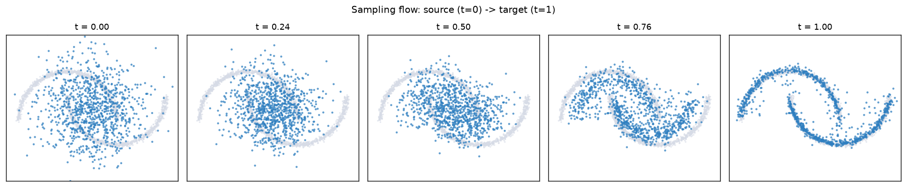

**Animated sampling.** The full Euler integration of the learned flow.

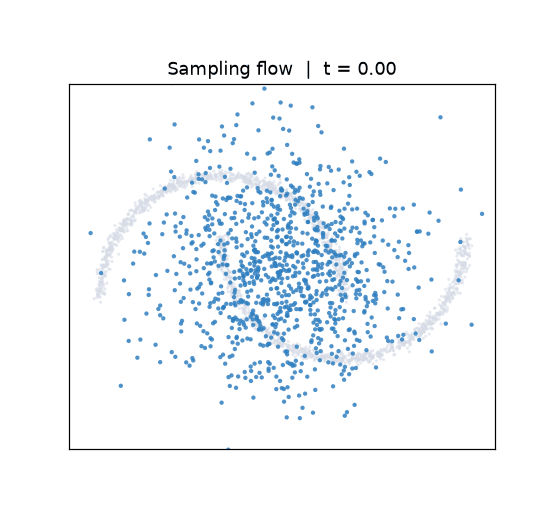

**Particle trajectories.** Individual paths from noise (deep teal, `t=0`) to
data (teal, `t=1`), traced by green streamlines.

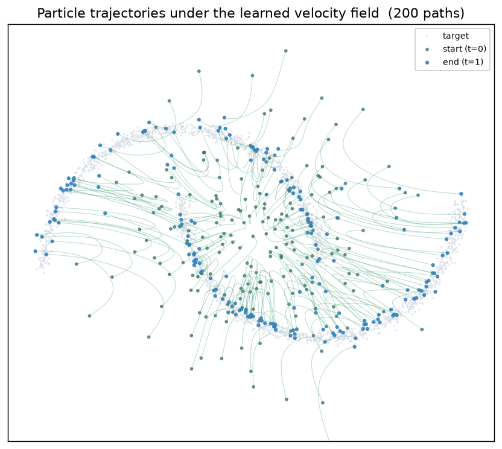

**Learned velocity field.** Quiver plots of \(v(x, t)\) at three times.

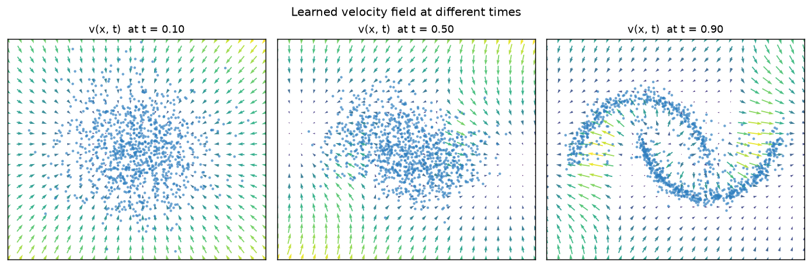

Early on the field points broadly inward. By \(t \approx 0.9\) it resolves the
two-moons structure.

### Reproduce

```bash
pip install -e ".[dev]" matplotlib
python examples/90-showcase/02-sampling-flow-viz/main.py
# artifacts are written to outputs/sampling_flow_viz/
```

## 90 showcase, mini-batch OT coupling

[`examples/90-showcase/03-minibatch-ot-viz/main.py`](https://github.com/phrugsa-limbunlom/deltaflow/blob/main/examples/90-showcase/03-minibatch-ot-viz/main.py)
contrasts two ways of pairing a source batch with a target batch before the
flow-matching regression. The independent coupling pairs sample `i` with sample
`i`, which scatters long crossing displacements across the batch. The mini-batch
OT coupling solves a small assignment problem (squared-L2 cost) and reorders the
target so each pair travels the shortest compatible distance.

**Why it matters.** Straighter pairings give the velocity field a smoother
regression target, so trajectories bend less and few-step sampling stays
accurate. The reported mean transport cost drops from the independent pairing to
the OT pairing on the same points.

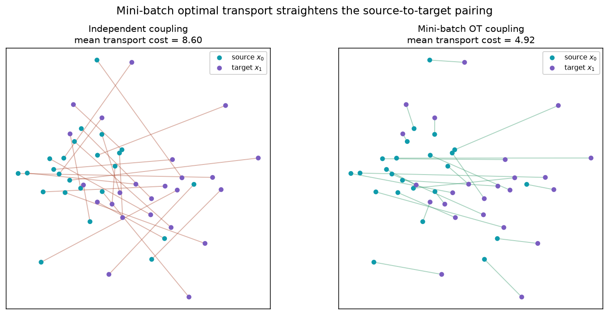

The source points are teal, the target points are purple. Notice how the tangle
of crossings on the left collapses into a near-parallel bundle on the right.

**Animated transport.** Both couplings carry the source cloud onto the same
target. The OT bundle stays orderly while the independent pairing sweeps long
crossing paths.

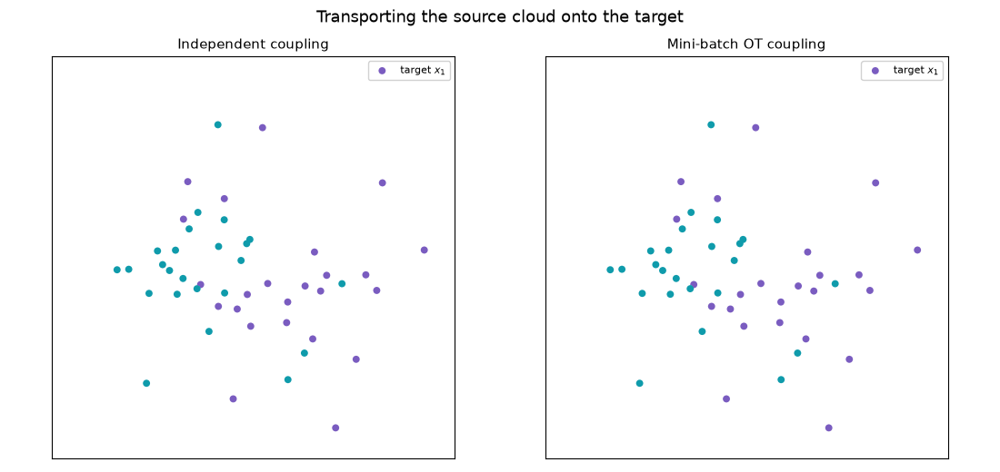

### Reproduce

```bash
pip install -e ".[dev]" matplotlib
python examples/90-showcase/03-minibatch-ot-viz/main.py
# artifacts are written to outputs/minibatch_ot_viz/
```

## 90 showcase, inverse posterior sampling

[`examples/90-showcase/04-inverse-posterior-viz/main.py`](https://github.com/phrugsa-limbunlom/deltaflow/blob/main/examples/90-showcase/04-inverse-posterior-viz/main.py)
trains an unconditional flow on a small image family, then reconstructs a
centre-masked measurement without any retraining. The `PosteriorSolver` steers
the same learned flow with a measurement-likelihood gradient, so the known
pixels stay fixed while the masked region is filled from the prior.

**Why it matters.** This is the inverse-problem workflow the library targets.
One generative model, trained once, adapts to different measurement operators at
sampling time. Here the operator is a binary centre mask, and the reconstruction
is the mean over sixteen posterior samples.

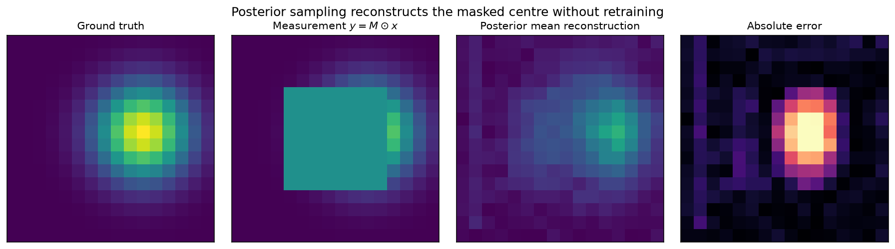

From left to right, the panels show the ground truth, the masked measurement,
the posterior mean reconstruction, and the absolute error. The error
concentrates inside the masked square, which is expected because the observed
region is anchored by the likelihood.

**Animated reconstruction.** The posterior mean starts as noise and settles into
the reconstruction as the solver walks from `t=0` to `t=1`, guided at every step
by the measurement likelihood.

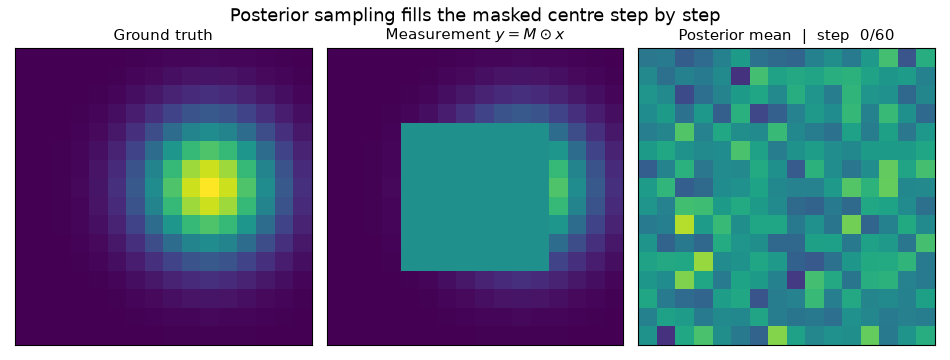

### Reproduce

```bash
pip install -e ".[dev]" matplotlib
python examples/90-showcase/04-inverse-posterior-viz/main.py
# artifacts are written to outputs/inverse_posterior_viz/
```

## 90 showcase, Schrödinger bridge

[`examples/90-showcase/05-schrodinger-bridge-viz/main.py`](https://github.com/phrugsa-limbunlom/deltaflow/blob/main/examples/90-showcase/05-schrodinger-bridge-viz/main.py)
first visualises the `SchrodingerBridgeInterpolant` path itself - the same
`(x0, x1)` pair sampled repeatedly at increasing diffusivity `sigma` - then
trains a velocity field against it (paired with `OTCoupling`) on a two-moons
target and inspects the resulting sampler.

**Why it matters.** It is easy to conflate the stochastic *training-time*
bridge with the *learned* sampler: training regresses onto the conditional
velocity of a noisy Brownian bridge, but generation integrates the resulting
(deterministic) probability-flow ODE, exactly like the other flow-matching
demos.

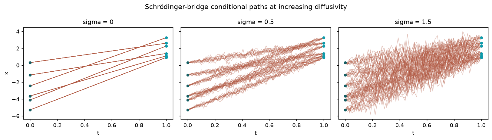

At `sigma=0` the bridge collapses onto the straight line (`LinearInterpolant`
exactly); larger `sigma` widens the stochastic corridor the model must learn
to regress against, without changing the deterministic ODE it produces.

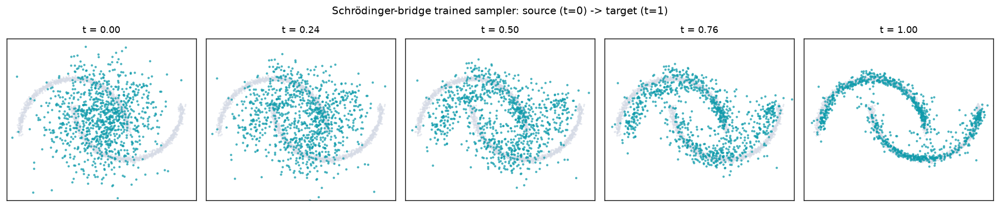

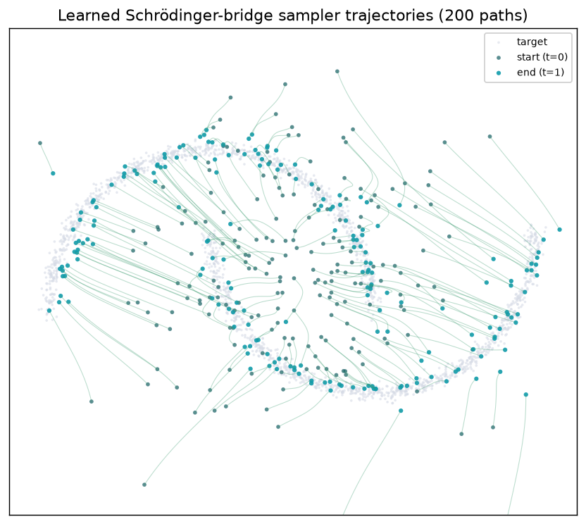

**Animated sampling.** The learned field integrates noise onto the two-moons
target from `t=0` to `t=1`, same as the flow-matching showcase, but the
underlying field was trained on the bridge path above.

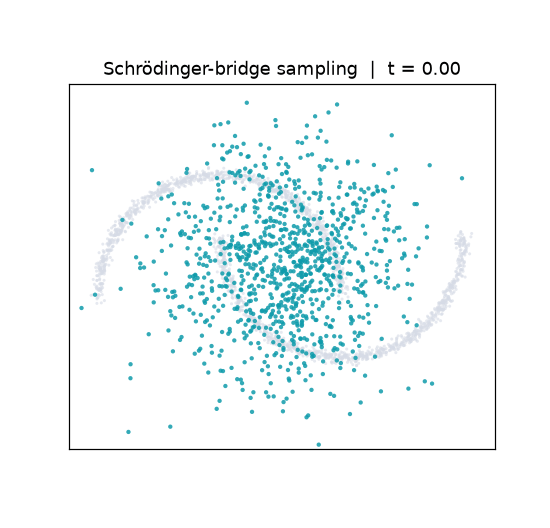

### Reproduce

```bash
pip install -e ".[dev]" matplotlib
python examples/90-showcase/05-schrodinger-bridge-viz/main.py
# artifacts are written to outputs/schrodinger_bridge_viz/
```

## 90 showcase, comparing all four paths

[`examples/90-showcase/06-algorithm-comparison/main.py`](https://github.com/phrugsa-limbunlom/deltaflow/blob/main/examples/90-showcase/06-algorithm-comparison/main.py)
trains the same MLP velocity field, for the same number of steps, on the same
two-moons target, under four interpolant/coupling configurations: Linear with
independent coupling, Linear with `OTCoupling`, `VariancePreservingInterpolant`,
and `SchrodingerBridgeInterpolant` with `OTCoupling`.

**Why it matters.** Every DeltaFlow algorithm is a configuration of one
training loop; this demo makes the practical differences between
configurations visible side by side, on identical data and compute budget.

**Animated sampling, side by side.** All four samplers integrate the same
noise batch over the same number of steps, so the only variable on screen is
the training configuration.

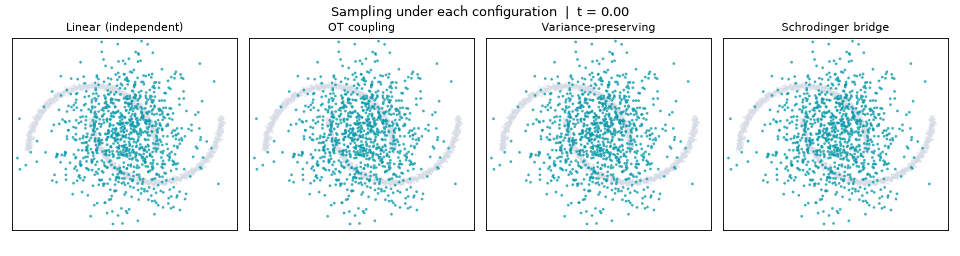

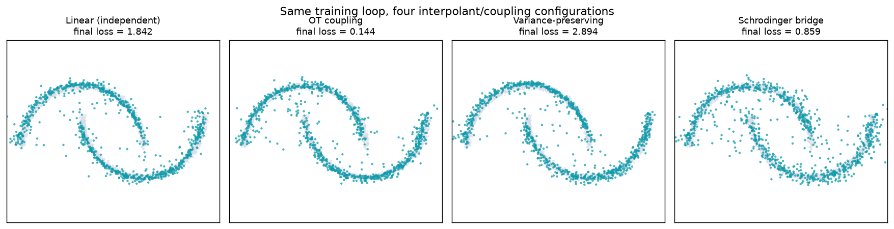

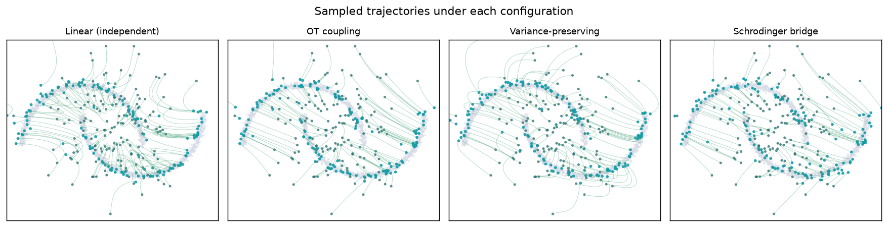

OT coupling produces visibly straighter trajectories than independent
coupling, which is the point of minimising batch transport cost before
regressing (see the `03-minibatch-ot-viz` showcase above for why).

### Reproduce

```bash
pip install -e ".[dev]" matplotlib
python examples/90-showcase/06-algorithm-comparison/main.py
# artifacts are written to outputs/algorithm_comparison/
```
