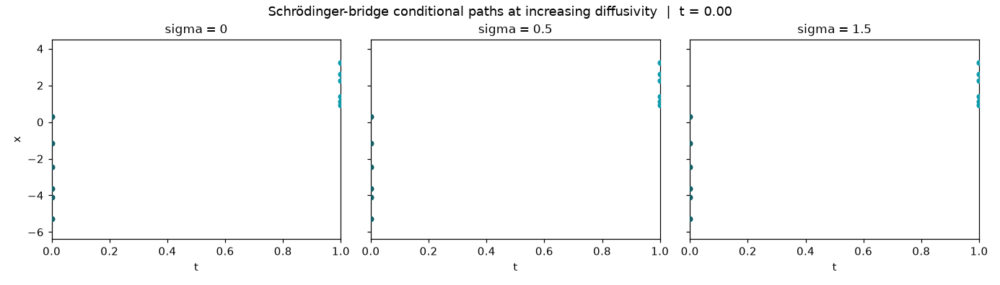

# DeltaFlow

DeltaFlow provides composable PyTorch primitives for generative modelling in
**data-scarce domains** such as medical imaging, with a focus on
*representation learning* and *studying the underlying data distribution* (not
just sample synthesis).

- :material-rocket-launch: **[Getting Started](getting-started/installation.md)**

    Install DeltaFlow and fit your first flow-matching model in a few lines.

- :material-book-open-variant: **[Guides](guides/flow-matching.md)**

    Task-oriented walkthroughs: flow matching, delta alignment, training, and
    inverse problems.

- :material-sitemap: **[Architecture](concepts/architecture.md)**

    The four base abstractions that make every component drop-in.

- :material-api: **[API Reference](api/index.md)**

    Auto-generated documentation for every public class and function.

## What is DeltaFlow?

DeltaFlow is built on a single idea, a **delta** (the change carried from one
distribution to another) and the **flow** that realises it.

- **Δ, the change between two things.** The learning signal is a *displacement*
  \(\Delta = x_1 - x_0\), the straight-line velocity carrying a source sample
  \(x_0\) (noise) to a data sample \(x_1\). Regressing a velocity field onto
  \(\Delta\) is exactly the flow-matching objective (Lipman et al., 2023).
- **Flow, integrating the change.** A learned field \(v_\theta(x, t)\) is
  integrated as an ODE \(dx/dt = v_\theta(x, t)\), transporting the *whole*
  source distribution onto the data distribution.
- **Straighter Δ via optimal transport.** **Mini-batch optimal-transport
  coupling** solves the discrete Kantorovich assignment on each batch, the
  source to target pairing that minimises squared transport cost, so the
  displacements, and the flow that follows them, are as straight as possible and
  sample in fewer steps. This hard assignment is the zero-entropy limit of the
  static Schrödinger bridge (Tong et al., 2023).

The *same difference principle* also drives an optional representation-learning
loss, **delta alignment**, which aligns the guidance-difference feature
\(\Delta h = h_\text{cond} - h_\text{uncond}\) for generative pretraining in
data-scarce domains.

The library targets 2D radiography (chest X-ray, cephalometric, and hand
radiographs), but the core primitives (`interpolants`, `samplers`, `losses`,
`models.projector`) are domain-agnostic.

## Visualizing the algorithm

Flow matching learns a time-conditioned velocity field \(v(x, t)\) that
transports a simple source density (Gaussian noise, \(t=0\)) onto the data
distribution (\(t=1\)). The panels below come from the
[sampling-flow example](examples.md).

## Probability paths

The `interpolant=` argument selects the path noise and data connect along;
the *same* training loop, loss, and solver are reused across all of them.

| Interpolant | Path |
|---|---|
| `LinearInterpolant` | straight-line rectified-flow path, \(x_t = (1-t)x_0 + t x_1\) |
| `VariancePreservingInterpolant` | trigonometric diffusion path, \(\alpha_t = \sin(\tfrac{\pi}{2}t)\), \(\sigma_t = \cos(\tfrac{\pi}{2}t)\) |
| `OTInterpolant` | the linear path applied after a mini-batch OT re-ordering of \(x_0\) |
| `SchrodingerBridgeInterpolant` | entropic Schrödinger-bridge path, a Brownian bridge \(x_t = (1-t)x_0 + t x_1 + \sigma\sqrt{t(1-t)}\,z\) around the straight line, diffusivity \(\sigma\) |

### Schrödinger bridge

The dynamic Schrödinger bridge between noise and data, conditioned on an
endpoint pair, is a Brownian bridge around the straight-line path. Regressing
onto its conditional velocity trains a stochastic interpolant that recovers the
entropic optimal-transport bridge as the coupling of \((x_0, x_1)\) approaches
the true OT plan. Pairing endpoints with `OTCoupling` (rather than drawing them
independently) is what makes this approximation tight in practice
([De Bortoli et al., 2021](https://arxiv.org/abs/2106.01357);
[SF2M, Tong et al., 2024](https://arxiv.org/abs/2307.03672)).

### Comparing the paths

Every algorithm is the *same* training loop; only the `interpolant=` (and
optionally `coupling=`) argument changes. Training an identical MLP on a
two-moons target with each configuration for the same number of steps makes the
differences concrete. All four samplers below are integrated from the *same*
noise batch at the *same* number of steps.

OT coupling produces the straightest source-to-target trajectories of the four,
the practical benefit of minimising batch transport cost before regressing.
Reproduce these figures from the
[algorithm-comparison showcase](examples.md).

## What's inside

| Module | Role |
|---|---|
| `deltaflow.core` | Abstract base classes every component subclasses |
| `deltaflow.interpolants` | Probability paths (linear, mini-batch OT, variance-preserving, Schrödinger bridge) |
| `deltaflow.samplers` / `deltaflow.solvers` | Euler & Heun integration, posterior sampling |
| `deltaflow.losses` | Flow matching + delta alignment |
| `deltaflow.models` | Backbones, EMA, multi-scale projector heads |
| `deltaflow.inverse` | Measurement operators, Tweedie decomposition, likelihoods |
| `deltaflow.trainer` | Streaming data, mixed-precision loop, OT coupling |
| `deltaflow.datasets` | Radiograph dataset wrappers (chest / cephalo / hand) |

## Citation

If you use DeltaFlow in your research, please cite it (see
[`CITATION.cff`](https://github.com/phrugsa-limbunlom/deltaflow/blob/main/CITATION.cff)).
